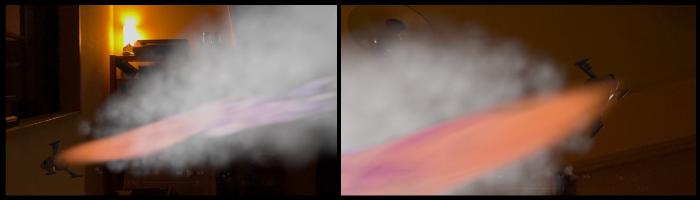
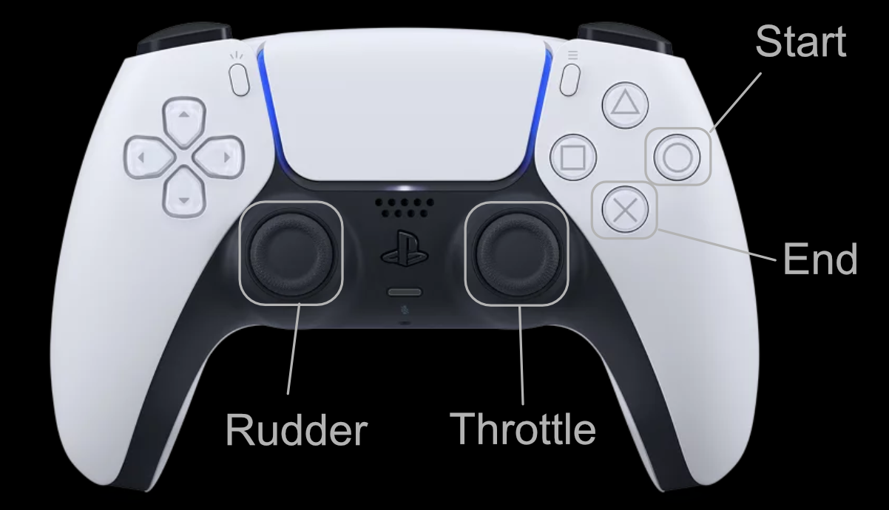

# Flying Toy Rocket for visionOS 2

This project shows a visionOS app that let users control a toy rocket with a Game Controller like a PlayStation Dualsense.
This app represents a very simple starting point and has no added game elements.
Arrange it as you like and make it a fun game.

- GitHub :
- Xcode 16.2 beta 2 , visionOS 2.1 (<em>visionOS 2.2 beta does not work with this project, due to its issue on Game Controller support.</em>)
- Since this app uses a Game Controller to control a toy rocket, you need to use an Apple Vision Pro and a Game Controller like a PlayStation Dualsense.

## Game Controller

This app supports only Game Controller as a control way of the toy rocket.
You'll soon want to use hand gestures instead. I'll leave that up to you. :)

## Next Steps

1. Place rings to pass through, make it a time trial, and place power-up items.
1. Play sound effects and BGM.
1. Add a wormhole to jump to an other point.
1. Create an immersive scene that surrounds you.
1. Add hand gestures to control the rocket without a Game Controller.
1. Use SharePlay so that multiple people can enjoy it.

It would be interesting to compete to successfully land on the landing site.

An example: Flying Space Shuttle

## Contribution

You probably already have a lot of ideas.
I want to keep this project simple so that it can be a starting point for many people.
So instead of sending a PR for your awesome improvement, please tell me your forked repo.
I will add that information to this page.

Thanks in advance.

<!--
## References
- Sample Code: ShaderGraph Examples in visionOS 1.2 [GitHub: ynagatomo/SGMExamples](https://github.com/ynagatomo/SGMExamples)
-->

<!--
## Change logs

click to open

1. [Nov 10, 2024] xxx

-->

## License

MIT License

since Nov, 2024
